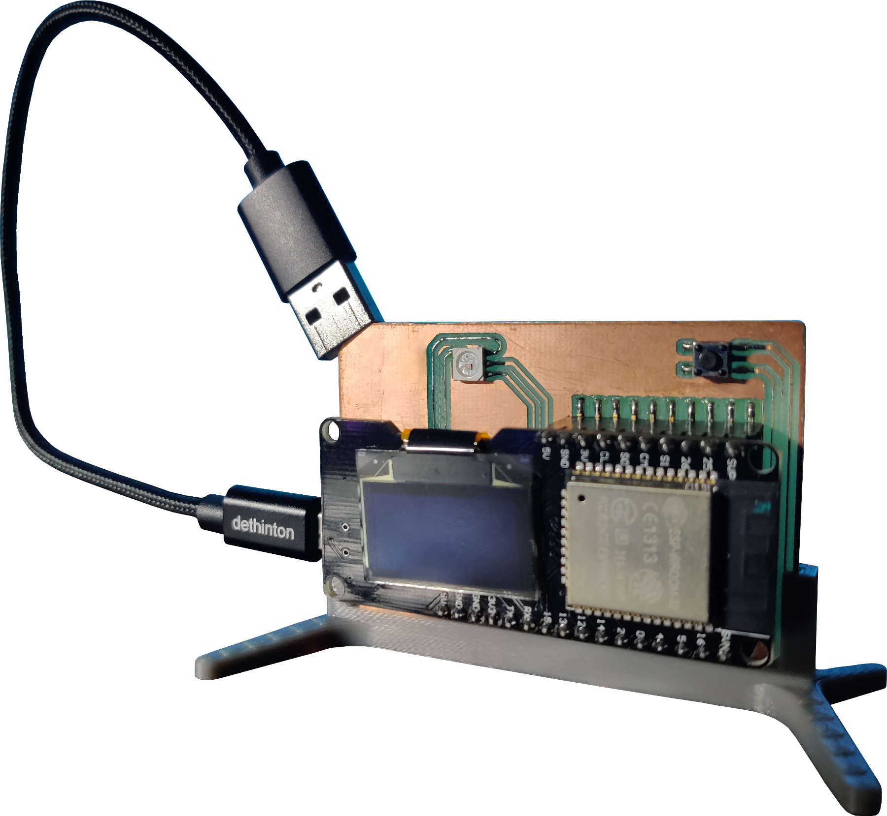

Remote User Monitor
---

The project creates an interface to monitor the state of an application running on a computer. Assuming you have a server and a process you are interested in, you can visualize whether the process is running or not, and which users are remotely connected to the server. You can watch a demo [here](https://www.youtube.com/watch?v=AxPdPzObXUI). For more information behind this project, you can read [here](http://nlamprian.me/project/hardware/design/2019-08-18-remote-user-monitor).



The project is comprised of a device (a WEMOS LoLin32 board with an OLED screen, a DotStar LED and a tactile switch) and a client application that drives the device.

The screen outputs information (name, hostname, ip... it's up to you) about the users, the LED has the following states:

* green: non-running application, no users
* yellow: non-running application, at least one user
* red: running application, at least one user
* flashing red: running application, no users

and the switch when pressed disconnects the users from the server.


Device
---

The code is set up as an Arduino library+sketch and it should be able to work with other Arduino compatible boards. The project depends on the [esp8266-oled-ssd1306](https://github.com/ThingPulse/esp8266-oled-ssd1306), [Adafruit_DotStar](https://github.com/adafruit/Adafruit_DotStar), [Bounce2](https://github.com/thomasfredericks/Bounce2) libraries.

You can find the PCB design for the device on [EasyEDA](https://easyeda.com/nlamprian/remote-user-monitor). It's a signle-sided board and has only SMD components.

There is also a 3D printable base for the board on [Thingiverse](https://www.thingiverse.com/thing:3814117).


Driver
---

The driver consists of a Python script that gathers the necessary information and forwards it to the device. It expects 3 user-defined bash scripts:

* `process.sh`: Returns the state of the process. If the process is running, exit code is 0. Otherwise, exit code is 1
* `users.sh`: Outputs information about the users on the standard output. The information can be anything, as long as it's one line per user
* `gtfo.sh`: Disconnects the users. It's being executed when the switch is pressed

You can edit these scripts and customize them to your own application.


Installation
---

To install the driver, execute the following commands

```
git clone https://github.com/nlamprian/remote-user-monitor ~/remote-user-monitor
cd ~/remote-user-monitor
sudo ./install.sh
```

After the installation has finished, there should be a systemd service that autostarts on boot and enables communication with the device. To check the status of the service, do

```
systemctl status remote-user-monitor.service
```

To uninstall the driver, run

```
cd ~/remote-user-monitor
sudo ./install.sh -u
```
